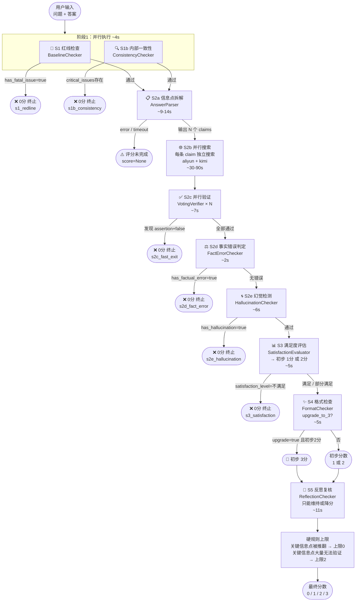

# 评分流水线 - 单条数据生命周期

一条数据从输入到输出最终分数，经过 6 个阶段、最多 8 次 LLM 调用。任意阶段发现严重问题均立即终止后续步骤（快速失败）。

---

## 流程图



---

## 各阶段说明

| 阶段 | 名称 | 模型 | 典型耗时 | 终止条件 |
|------|------|------|----------|----------|
| S1 | 红线检查 | kimi | ~2s | `has_fatal_issue=true` → 0分 |
| S1b | 内部一致性 | gpt5 | ~2s（并行） | `critical_issues` 非空 → 0分 |
| S2a | 信息点拆解 | gpt5 | ~9-14s | LLM报错/超时 → score=None |
| S2b | 并行搜索 | aliyun+kimi | ~30-90s | 无终止，搜索失败的claim继续下游 |
| S2c | 信息点验证 | gpt5 | ~7s | `assertion+false` → 0分 |
| S2d | 事实错误判定 | gpt5 | ~2s | `has_factual_error=true` → 0分 |
| S2e | 幻觉检测 | gpt5 | ~6s | `has_hallucination=true` → 0分 |
| S3 | 满足度评估 | kimi | ~5s | `satisfaction_level=不满足` → 0分 |
| S4 | 格式检查 | kimi | ~5s | 无终止，决定是否升3分 |
| S5 | 反思复核 | kimi_thinking | ~11s | 只能维持或降分 |

**总耗时估算：**
- 快速失败（S1/S1b）：~4s
- S2a 超时失败：~14s
- 正常完成（N≈10条信息点）：~60-100s
- 正常完成（N≈30条信息点）：~120-180s（S2b 是瓶颈）

---

## 硬规则（代码层强制，不依赖 LLM）

| 规则 | 触发条件 | 效果 |
|------|----------|------|
| 关键信息点被推翻 | `critical_false_cnt > 0` | 最终分数上限 0 |
| 关键信息点大量无法验证 | `critical_null_count >= 2` | 最终分数上限 2（禁止升3分） |
| 反思不得升分 | 始终 | `reflected_score > preliminary` 时强制回退 |
| 反思发现红线/事实错误 | `has_factual_error` 或 `has_redline` | 强制 0 分 |

---

## result dict 关键字段

```python
{
    "score": 0 | 1 | 2 | 3 | None,    # None 表示流水线异常终止
    "reasoning": "...",                # 各阶段关键结论拼接
    "preliminary_score": int,          # 反思前分数（与 score 不同时显示）
    "terminated_at": "s1_redline" | "s1b_consistency" | "s2c_fast_exit"
                   | "s2d_fact_error" | "s2e_hallucination" | "s3_satisfaction" | None,
    "layer1_baseline": {...},          # S1 输出
    "stage_consistency": {...},        # S1b 输出
    "stage0_parsing": {...},           # S2a 输出（含 claims 列表）
    "stage1_searches": {...},          # S2b 搜索结果
    "layer2_verification": {...},      # S2c 验证汇总
    "stage2_fact_check": {...},        # S2d 输出
    "stage2b_hallucination": {...},    # S2e 输出
    "stage3_satisfaction": {...},      # S3 输出
    "stage4_format": {...},            # S4 输出
    "reflection": {...},               # S5 输出
}
```
