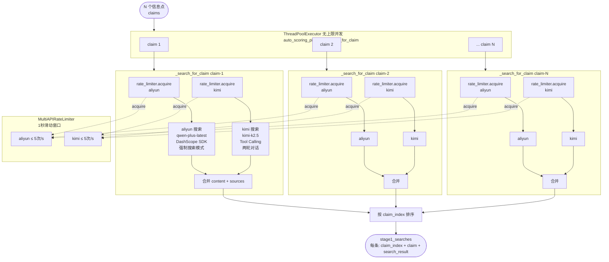

# S2b 搜索阶段详细流程

S2b 是整个流水线最耗时的阶段（瓶颈）。N 条信息点全部并发提交，每条信息点内部 aliyun + kimi 再次并发，速率由 `MultiAPIRateLimiter` 在实际 API 调用前控制。

---

## 整体结构图



---

## 两种搜索服务的工作方式

### aliyun（阿里云百炼 / Qwen）

使用 **DashScope 原生 SDK**，在模型请求中开启联网工具，模型自动决定何时搜索、搜索什么。

```
请求参数：
  model: qwen-plus-latest
  tools: [{"type": "web_search", "web_search": {"search_strategy": "max", "forced_search": true}}]
  enable_search: true

返回：
  content: 模型综合搜索结果后的回答
  sources: [{title, url, snippet}, ...]  ← 必定返回来源列表
```

**特点：** 单次调用，模型内部执行搜索并直接输出带引用的回答，来源可靠。

---

### kimi（Kimi K2.5）

使用 **OpenAI Tool Calling 两轮对话**，第一轮模型决定调用 `$web_search` 工具，第二轮将搜索结果注入并生成最终回答。

```
第一轮：
  messages: [system, user]
  tools: [{"type": "builtin_function", "function": {"name": "$web_search"}}]
  → 模型返回 tool_calls: [{"name": "$web_search", "arguments": {"query": "..."}}]

第二轮：
  messages: [system, user, assistant(tool_call), tool(搜索结果)]
  → 模型返回最终回答 content
```

**特点：** 两轮对话，搜索词由模型自主生成，适合复杂查询的意图理解。

---

## 速率限制机制

```
MultiAPIRateLimiter
├── 每个 provider 独立计数
├── 窗口大小：1 秒（滑动窗口）
├── 上限：5 次 / 秒 / provider
└── 触发位置：_search_single_provider() 实际发起 API 调用前

流程：
  1. 线程调用 rate_limiter.acquire(provider_name, timeout=60)
  2. 检查过去 1 秒内该 provider 的调用次数
  3. 若未超限 → 立即通过，记录时间戳
  4. 若超限   → 等待（sleep 到窗口空出位置）
  5. 超过 timeout=60s 未获得令牌 → 抛出超时异常
```

**实际效果：**
- 10 条 claim × 2 provider = 最多同时 20 个 acquire 请求
- 每个 provider 每秒最多放行 5 个 → 20 个请求约需 2 秒排完队
- 网络往返 + 模型推理时间通常远大于排队等待时间，速率限制实际影响不大

---

## 搜索结果的数据结构

```python
# stage1_searches（存入 result dict）
{
    "total_claims": N,
    "parallel_execution": True,
    "searches": [
        {
            "claim_index": 1,          # 与 S2c 验证结果对齐的索引
            "claim": {                 # 原始信息点
                "id": "C1",
                "type": "objective",
                "claim": "信息点文本",
                "critical": True,
            },
            "search_result": {         # 合并后的搜索结果
                "success": True,
                "combined_content": "aliyun内容\n\n---\n\nkimi内容",
                "sources": [{"title": "...", "url": "...", "snippet": "..."}],
                "providers_used": ["aliyun", "kimi"],
                "individual_results": [...]
            }
        },
        ...
    ]
}
```

---

## 常见问题

| 问题 | 原因 | 处理 |
|------|------|------|
| 单条 claim 搜索超时 | 网络抖动或 provider 响应慢 | 超时后该 claim 的 `search_result.success=False`，下游验证时标记为 `verified=null` |
| 所有 claim 搜索很慢 | S2b 是串行还是并行？ | 全部并发提交，总时间 ≈ 最慢那条 claim 的搜索时间，不是 N × 单条时间 |
| 速率限制触发 | 短时间内超过 5次/s | rate_limiter 自动排队等待，无需重试逻辑 |
| kimi 搜索返回空 | 第一轮未触发 tool_call | 视为搜索失败，`content=""`, `sources=[]` |
